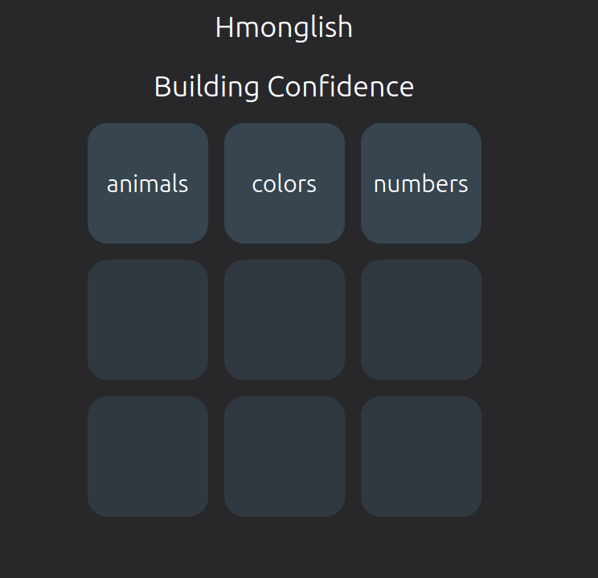
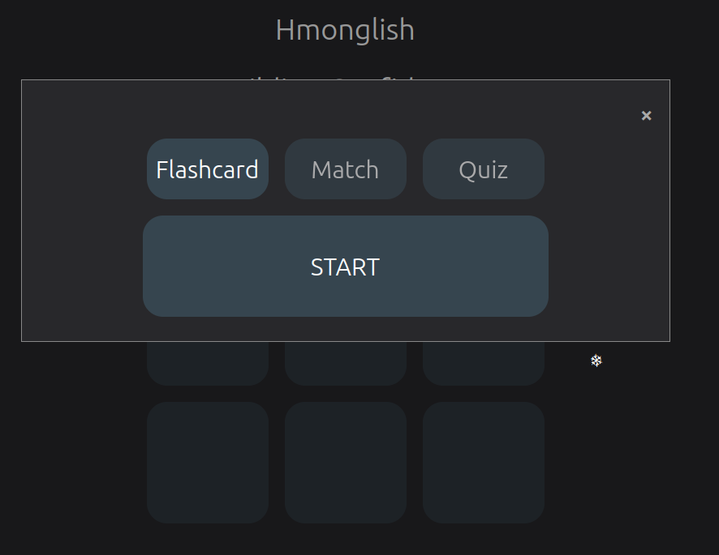
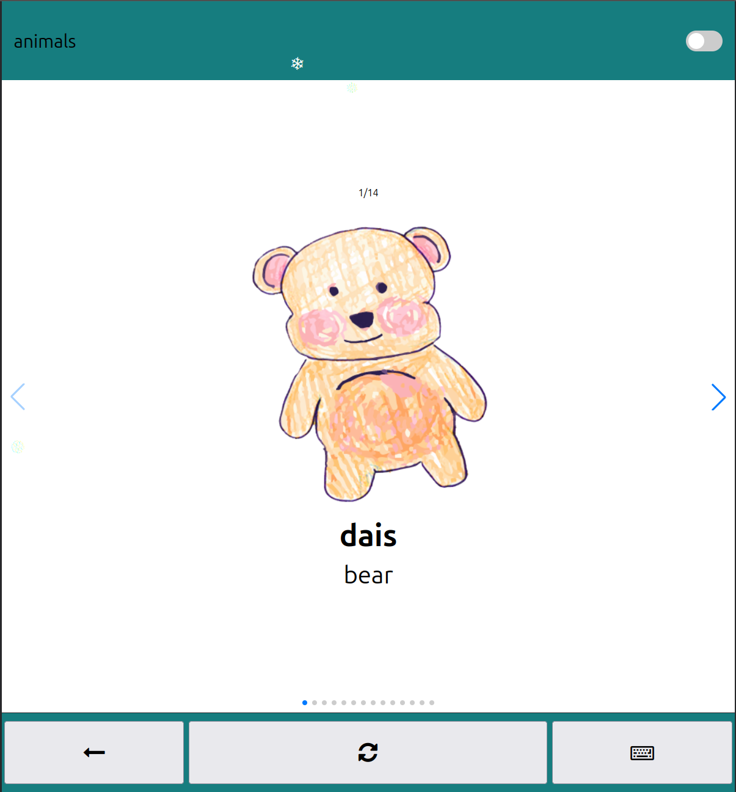
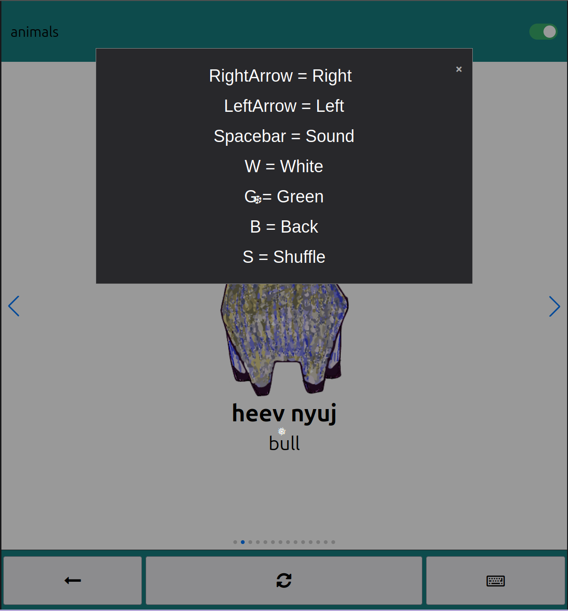

# Hmonglish

A lightweight web application designed to help users learn basic Hmong vocabulary through interactive flashcards and simple study tools.

**Live Application:** https://johnnyjvang.github.io/hmonglish/

---

## Overview

Hmonglish is an interactive learning tool focused on building foundational vocabulary in the Hmong language. The application provides a simple and intuitive interface where users can explore categories and study using flashcards.

The project emphasizes usability, accessibility, and interactive learning through both mouse and keyboard controls.

---

## Application Demo

### Homepage

  

---

### Category Selection

  

---

### Flashcard Mode

  

---

### Keyboard Controls Guide

  

---

## Features

- Category-based learning (Animals, Colors, Numbers)
- Flashcard-based study system
- Swipe navigation using Swiper.js
- Keyboard controls for efficient studying
- Randomize/shuffle functionality
- Toggle between White Hmong and Green Hmong
- Mobile-friendly responsive design
- Help modal displaying keyboard shortcuts

---

## How It Works

1. Select a category from the homepage
2. Choose a learning mode (Flashcards currently implemented)
3. Start studying:
   - Swipe or use arrow keys to navigate
   - Press spacebar to play audio
   - Toggle dialect using switch or keyboard
   - Shuffle cards for randomized learning

---

## Keyboard Controls

- Right Arrow → Next card  
- Left Arrow → Previous card  
- Spacebar → Play audio  
- W → White Hmong  
- G → Green Hmong  
- B → Back to homepage  
- S → Shuffle cards  
- K → Open help menu  

---

## Technologies Used

- HTML5
- CSS3
- JavaScript (Vanilla)
- Swiper.js (for swipe-based navigation)
- Font Awesome (icons)

---

## Future Improvements

- Match game mode
- Quiz mode
- Expanded vocabulary categories
- Progress tracking
- Improved UI/UX enhancements

---

## Purpose

This project was created to provide an accessible and interactive way to learn Hmong vocabulary, with a focus on building confidence through repetition and engagement.

---

## License

MIT License
